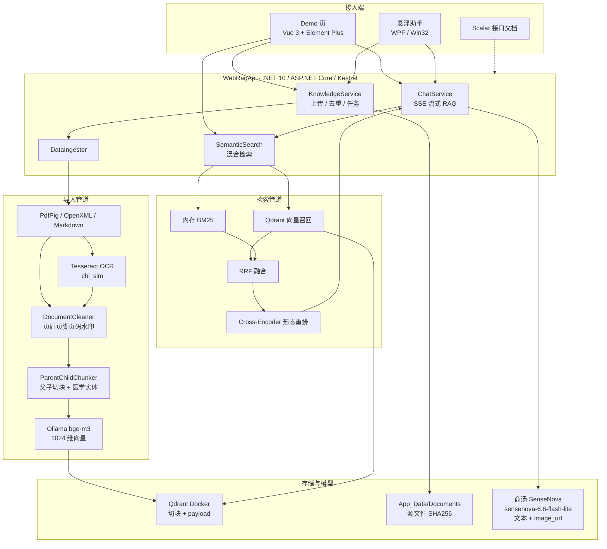

# WebRagApi — RAG 知识库问答服务

基于 .NET 10 的 RAG（检索增强生成）知识库 WebAPI。框架参考 ChatRAG（去除了 Aspire），
模型配置复用 AIChatApp（商汤 SenseNova 聊天模型 + 本地 Ollama bge-m3 向量模型），
向量库使用 Qdrant（Docker 运行，数据落本地磁盘）。

## 环境要求

| 组件 | 说明 |
| ---- | ---- |
| .NET 10 SDK | `net10.0` |
| Docker Desktop | 运行 Qdrant（见下方启动命令） |
| Ollama | 需已拉取 `bge-m3:567m` 向量模型（1024 维） |
| 商汤 SenseNova API Key | `dotnet user-secrets set "Chat:ApiKey" "你的Key"`（不要写进仓库） |

### 启动 Qdrant

```bash
docker run -d --name webrag-qdrant -p 6333:6333 -p 6334:6334 \
  -v E:\sourcecode\csharp\webragapi\qdrant_storage:/qdrant/storage qdrant/qdrant
```

数据挂载在项目本地的 `qdrant_storage` 目录，容器删除后数据仍在。

### 启动服务

```bash
dotnet run
```

- 服务地址：<http://localhost:5000>（`launchSettings.json` 的 http 配置；部分文档仍写 5229）
- 接口文档（Scalar）：<http://localhost:5000/scalar>（接口说明来自控制器 XML 注释）
- 网页验证 Demo：<http://localhost:5000/>（`wwwroot/index.html`，Element Plus）

## 技术栈与流程



| 环节 | 技术 |
| ---- | ---- |
| 运行时 | .NET 10、ASP.NET Core、Kestrel |
| 文档解析 | PdfPig、OpenXML（docx）、Markdown、老 doc |
| 扫描件 | Tesseract `chi_sim`、SkiaSharp 渲染 |
| 切块 / 图谱轻量 | 父子层次树、医学实体词典（不上 Neo4j） |
| 向量 | 本地 Ollama `bge-m3:567m`，1024 维余弦 |
| 向量库 | Qdrant（Docker，数据在 `qdrant_storage`） |
| 词法检索 | 内存 BM25 + RRF + 成对重排 |
| 生成 | 商汤 SenseNova 流式 Chat Completions（可图文） |
| Demo / 文档 | Vue 3、Element Plus、Scalar OpenAPI |

## 目录结构

```text
webragapi/
├── Program.cs                          # 启动：DI、Qdrant、Ollama、商汤、OpenAPI/Scalar、静态页
├── WebRagApi.csproj                    # 包引用；生成 XML 注释给 Scalar；复制 tessdata
├── WebRagApi.slnx                      # 解决方案
├── appsettings.json                    # 聊天/向量/知识库/检索/更新清单（不含密钥）
├── appsettings.Development.json        # 开发覆盖
├── Controllers/
│   ├── ChatController.cs               # GET /api/chat/config、POST /api/chat/stream（SSE，可带图）
│   ├── KnowledgeController.cs          # 文档上传/列表/详情/删除、导入任务、检索
│   └── UpdateController.cs             # GET /api/update/manifest 客户端更新清单
├── Models/
│   ├── Dto.cs                          # 请求/响应 DTO（含 images、父子切块 parentText/entities）
│   ├── ChatOptions.cs                  # Chat:* 商汤 Endpoint/Model/ApiKey
│   ├── RetrievalOptions.cs             # Retrieval:* 默认 rerank、RRF k
│   └── UpdateOptions.cs                # 更新包版本、SHA256、下载地址
├── Services/
│   ├── ChatService.cs                  # RAG 问答：检索→组上下文→商汤流式；图片转 image_url
│   ├── SenseNovaCompletionService.cs   # 调商汤 /v1/chat/completions（含 thinking）
│   ├── SemanticSearch.cs               # 向量 + BM25 + RRF + 重排；查询实体扩展
│   ├── KnowledgeService.cs             # 上传落盘、哈希去重、列表缓存、删除
│   ├── IngestionTaskManager.cs         # 导入任务进度（内存）
│   ├── BatchingEmbeddingGenerator.cs   # Ollama embedding 再拆小批
│   ├── FinishReasonRewriteHandler.cs   # 兼容商汤流式 finish_reason
│   ├── GlobalExceptionHandler.cs       # 全局异常
│   ├── Ingestion/                      # 解析 → 清洗 → 切块 → 写入
│   │   ├── DataIngestor.cs             # 按文档提交入库；全局串行；失败只回滚本篇
│   │   ├── DocumentReader.cs           # 按扩展名分发 pdf/docx/doc/md/图片
│   │   ├── PdfPigReader.cs             # PDF 文字层；无字则 OCR；去掉页顶/页底带
│   │   ├── DocxReader.cs / BinaryDocReader.cs
│   │   ├── ImageOcrReader.cs           # 扫描件图片 OCR
│   │   ├── TesseractOcr.cs             # 本地 Tesseract chi_sim
│   │   ├── DocumentCleaner.cs          # 去页码、重复水印/页眉页脚短句
│   │   ├── ParentChildChunker.cs       # 父子切块树（父=小节，子≈280 token 入库）
│   │   ├── MedicalEntityTagger.cs      # 医学实体标签 + 心衰→心力衰竭 等扩展
│   │   ├── QdrantChunkWriter.cs        # 切块向量化写入；payload 含 parent/entities
│   │   └── ContentHash.cs              # 文件 SHA256，边拷边哈希
│   └── Retrieval/
│       ├── Bm25Index.cs                # 内存 BM25 倒排（含实体词）
│       ├── ReciprocalRankFusion.cs     # RRF 融合向量与 BM25
│       ├── CrossEncoderReranker.cs     # 成对打分重排（尚未加载 bge-reranker 权重）
│       ├── ChineseLexicalTokenizer.cs  # 汉字单字+二字、拉丁词
│       └── DocumentCatalog.cs          # 文档列表缓存（只滚元数据）
├── wwwroot/
│   ├── index.html                      # Demo：上传/检索/SSE 问答（Element Plus）
│   └── updates/                        # 客户端 ZIP；*.zip 不进 Git（GitHub 单文件 100MB 上限）
├── tessdata/chi_sim.traineddata        # Tesseract 简体中文模型（随项目复制到输出目录）
├── scripts/                            # 更新包 SHA256 计算脚本
├── App_Data/                           # 运行时：上传文档等（不进 Git）
└── qdrant_storage/                     # Qdrant 磁盘数据（不进 Git）
```

## 接口一览

| 接口 | 方法 | 作用 |
| ---- | ---- | ---- |
| `/api/chat/stream` | POST | AI 流式问答（SSE）。`end` 事件含完整回答、`sources` 引用来源、`references` 召回切块 |
| `/api/chat/config` | GET | 公开模型能力（不含 API Key） |
| `/api/knowledge/documents` | POST | 上传文档（pdf/doc/docx/md，扫描件 png/jpg/jpeg/tif/bmp，多文件） |
| `/api/knowledge/documents` | GET | 获取知识库文档列表 |
| `/api/knowledge/documents/{id}` | GET | 查看文档详情（含切块预览） |
| `/api/knowledge/documents/{id}` | DELETE | 删除文档及其向量 |
| `/api/knowledge/tasks` | GET | 列出最近的导入任务（含进行中的） |
| `/api/knowledge/tasks/{id}` | GET | 查询文档导入进度 |
| `/api/knowledge/search` | POST | 检索（默认向量+BM25+RRF+重排；`mode=vector/hybrid/rerank`） |

### 流式问答事件格式（/api/chat/stream）

请求体示例（可带深度思考与图片）：

```json
{
  "question": "图片里有什么",
  "images": ["data:image/jpeg;base64,..."],
  "history": [],
  "topK": 8,
  "thinking": true,
  "reasoningEffort": "medium"
}
```

图片按商汤文档以 `content` 数组中的 `image_url` 块发给模型（data URL 或 https）。纯文字时 `content` 仍是字符串。

响应为 SSE（`event:` + `data: {JSON}`）：

```
event: meta
data: {"type":"meta","references":[...]}      # 检索命中明细（含相似度得分）
event: reasoning
data: {"type":"reasoning","text":"..."}       # 思考过程增量（thinking=true 时）
event: mode
data: {"type":"mode","mode":"knowledge_base"} # 回答模式（解析到模型首行标记后立即推送）
event: delta
data: {"type":"delta","text":"高血压的"}       # 正文增量（多条）
event: end
data: {"type":"end","mode":"...","text":"完整回答","sources":[...],"references":[...]}
```

`thinking=false` 时向商汤传 `reasoning_effort: "none"`，不推 `reasoning` 事件。

`mode=knowledge_base` 时 `sources` 为按文档聚合的引用（页码）；`mode=model` 时来源为空。

前端用 `fetch` + `ReadableStream` 读取（`EventSource` 只支持 GET）；`references`/`sources` 中，
`sources` 只含与最高分切块接近的真正回答依据（分差 ≤0.15 且分数 ≥0.5），`references` 保留完整召回列表供调试。

**SSE 防缓冲**（2026-09）：`/api/chat/stream` 响应已加 `Cache-Control: no-cache, no-transform`、
`X-Accel-Buffering: no`，并在服务端调用 `DisableBuffering()`——部署在 nginx/IIS 等反向代理后面时，
SSE 事件也会即时推送，不会被代理缓冲到请求结束才一次性下发。

## 行为说明

- **问答策略（智慧病历模式）**：检索到的切块始终交给大模型，由模型判断语义相关性后二选一——
  - 知识库内容与问题真正相关 → 基于知识库回答，返回引用来源（响应 `mode = "knowledge_base"`）。用户上传的公文、教材等非医疗文档只要能回答该问题，同样走知识库，不得以“只能问医疗”拒绝。
  - 不相关（注意：领域相同 ≠ 相关，模型判断比相似度阈值可靠）→ 医疗健康问题由大模型基于自身医学知识直接推理（`mode = "model"`）；知识库也答不了的非医疗问题才礼貌拒答。
  - 请求参数 `allowModelAnswer: false` 可退回严格 RAG（只答知识库内容）。
- **增量导入**：按**文件内容 SHA256** 去重（写入 Qdrant payload 的 `contenthash`）。内容相同即使文件名不同也会跳过；同名但字节变了会删除旧向量再导入。列表/删除仍用文件名当 `documentid`。
- **批量入库**：按**文档提交**——一篇解析切块并 Upsert 成功后，再删该篇旧切块；失败只回滚本篇新点，不删其它文档。单篇内仍按 `Knowledge:ChunkWriteBatchSize`（默认 32）批量 embedding。导入任务全局串行，避免并行互踩。
- **无需重启**：上传后后台异步导入（返回 taskId 可查进度），导入完成后立即可被检索/问答，不用重启服务。
- **流式输出**：Demo 页与悬浮助手都走 `/api/chat/stream`（SSE）。悬浮助手（AI-Emr-Floating-Assistant）不再直连商汤。
- **图片问答（多模态）**：请求可带 `images`（`data:image/...;base64,...` 或 https），也可从 `messages` 最后一条 user 的 `images` 提取。后端按 OpenAI 兼容协议转成 `content` 数组里的 `image_url` 再调聊天模型。只发图、不打字也可以。纯文本模型不支持 vision 时发图可能报错或被忽略；知识库检索（Ollama bge-m3）不受影响。请求体上限约 32MB。
- **导入任务面板**：`GET /api/knowledge/tasks` 列出最近任务；文本提取与 OCR 都得不到内容时，会在任务明细中给出 0 切块警告。
- **扫描件 OCR**：无文字层的 PDF 页会自动用本地 Tesseract（`chi_sim` 简体中文）识别；png/jpg/jpeg/tif/bmp 图片扫描件同样走 OCR。有文字层的 PDF 仍抽文字，不 OCR。模型文件在 `tessdata/chi_sim.traineddata`。识别率不是 100%（印刷体中文常见错字，如药名形近字），目前未接 PaddleOCR。
- **文档目录**：`App_Data/Documents`（相对项目根目录，可在 `appsettings.json` 的 `Knowledge:DocumentsPath` 修改）。
- **文档清洗**：去掉「第 N 页」、单独一行的纯数字页码（1～3 位，如 `12`）、`1/20` 等；PDF 多页按真实页码统计跨页重复短句（水印/页眉）；md/docx 的 section 不当页，避免误删重复小标题。PDF 再按坐标去掉页顶/页底约 7% 的文字带。Word 页眉页脚不在正文 part。尚未做：印章图形擦除、栏间乱序重排、表格结构还原。
- **切块策略**：父子层次树（Parent-Child）。父块=同一标题下的小节；子块≈280 token（重叠 40）写入向量库，payload 带 `parentid` / `parenttext` / `entities`。检索命中子块后把父段扩进问答上下文。不上 Neo4j。
- **医学实体**：规则词典打标签（病种/药名/检查等）并做查询同义词扩展（如 心衰→心力衰竭）。
- **检索管道**：见下方「检索管道（向量 + BM25 + RRF + 重排）」。
- **模型**：聊天 `sensenova-6.8-flash-lite`（商汤）；向量 `bge-m3:567m`（本地 Ollama，1024 维，余弦相似度）。

## 检索管道（向量 + BM25 + RRF + 重排）

问答和 Demo 检索默认走完整管道，不再只做单一向量检索：

```text
查询
  ├─ 向量召回（Qdrant + bge-m3 余弦）
  └─ BM25 召回（内存倒排，中文单字+二字 + 拉丁词）
        ↓
     RRF 按名次融合（不比较分数量纲）
        ↓
     Cross-Encoder 形态重排（query 与切块成对打分）
        ↓
     截断 TopK → 问答上下文 / 检索结果
```

三个组件的关系：

| 组件 | 作用 | 是否必须一起 |
| ---- | ---- | ---- |
| BM25 | 词法检索，对人名、药名、文号更准 | 可单独召回，但要和向量拼在一起才有「混合检索」 |
| RRF | 按排名融合多路结果 | **不能单独用**，至少要两路（向量 + BM25） |
| Cross-Encoder 重排 | 融合后再对 (问题, 切块) 成对打分 | 可后加；当前默认打开 |

`POST /api/knowledge/search` 的 `mode`：

```json
{ "query": "高血压急症", "topK": 5, "mode": "rerank" }
```

| mode | 行为 |
| ---- | ---- |
| `vector` | 仅 Qdrant 向量（旧行为） |
| `hybrid` | 向量 + BM25，RRF 融合 |
| `rerank` | hybrid 后再重排（默认；问答也走这个） |

Demo 页检索区可切换三种模式，结果里会带最终得分，以及可选的 `vectorScore` / `bm25Score`。

配置在 `appsettings.json` 的 `Retrieval` 节：`DefaultMode`、`CandidateMultiplier`（每路多取几倍候选）、`RrfK`（RRF 常数，常用 60）。

**关于 bge-reranker**：当前重排是 Cross-Encoder **形态**（成对打分），用覆盖率、短语命中、向量分、BM25 分加权，**尚未加载 BAAI `bge-reranker-base` / `bge-reranker-v2-m3` 神经网络权重**。要换成真正的 bge-reranker 需再部署 ONNX（或其它本地推理）和模型文件。

**引用与同领域文档**：接口 `sources` 只保留与最高分接近的切块（分差 ≤0.15 且分数 ≥0.5）。TopK 里其它同领域文档（例如问「高血压急症」时召回的《高血压管理指南》）仍会进入模型上下文，模型可能在正文末尾一并写出；这是「召回宽、引用窄」的现有策略，不是检索算错。

## Demo 页（wwwroot/index.html）

首页用 Vue 3 + Element Plus。功能与接口一致：拖拽上传、文档列表（含文档名）、导入任务轮询、三种检索模式、SSE 问答。问答卡片标题栏右侧有「发送」按钮（Ctrl+Enter 也可发）。CDN 加载 unpkg 上的 Vue / Element Plus。

2026-09 更新：SSE 事件解析同时兼容 camelCase / PascalCase 字段（`evt.text` / `evt.Text`），
检索区新增模式下拉（仅向量 / 向量+BM25+RRF / RRF+重排）与 TopK 选择，结果展示最终得分及
可选的向量 / BM25 分项；任务面板加进度条与空状态；回答区改用 `<pre>` 保留换行格式。

## Scalar 接口文档

`/scalar` 读取 `/openapi/v1.json`。项目开启了 `GenerateDocumentationFile`，控制器与 DTO 的 XML 注释会进入 OpenAPI（分组：AI 问答 / 知识库 / 客户端更新）。文档标题为 WebRag API。

## 切换聊天模型（生产部署）

聊天模型走 **OpenAI 兼容协议**，DeepSeek、Qwen、本地 Ollama、vLLM 等全部兼容，
生产环境换模型**不需要改任何代码**，只改 `appsettings.json` 的 `Chat` 节：

| 部署方式 | Endpoint | ApiKey | Model |
| ---- | ---- | ---- | ---- |
| 商汤 SenseNova（当前开发配置） | `https://token.sensenova.cn/v1` | 商汤 Key | `sensenova-6.8-flash-lite` |
| DeepSeek 官方 API | `https://api.deepseek.com/v1` | DeepSeek Key | `deepseek-chat` / `deepseek-reasoner` |
| 本地 Ollama 跑 DeepSeek 14B | `http://服务器IP:11434/v1` | 任意非空串（如 `ollama`） | `deepseek-r1:14b` |
| 本地 Ollama 跑 Qwen | `http://服务器IP:11434/v1` | 任意非空串 | `qwen2.5:14b` |
| vLLM / Xinference 私有化部署 | `http://服务器IP:8000/v1` | 部署时设置的 Key | 部署时的模型名 |
| 阿里云百炼 DashScope | `https://dashscope.aliyuncs.com/compatible-mode/v1` | DashScope Key | `qwen-plus` 等 |

`Chat:RewriteFinishReason` 保持 `true` 即可（对标准服务是纯透传，只在响应带空 `finish_reason` 时才改写）。

**API Key 不入库**：本仓库的 `appsettings.json` 中 `Chat:ApiKey` 为空占位。开发环境执行
`dotnet user-secrets set "Chat:ApiKey" "你的Key"`（本机已配置）；生产环境用环境变量
`Chat__ApiKey` 或 `appsettings.Production.json` 提供，服务启动时缺失会直接报错提示。

注意：向量模型（Ollama bge-m3）与聊天模型相互独立；**已入库的向量与聊天模型无关**，换聊天模型不需要重新导入文档。
另外，`[知识库]`/`[模型]` 模式标记依赖模型遵循提示词格式的能力，主流 14B 以上模型都没问题；
若换用更小的模型发现 mode 判定不准，接口会自动按相似度兜底判定。

## 技术要点

- 导入管道：`Microsoft.Extensions.DataIngestion`（解析 → 语义切块），
  写入器为自定义 `QdrantChunkWriter`（绕开 SK Qdrant 连接器仅支持 Guid/ulong 键的限制，
  同时把文件元数据直接补写进 Qdrant payload，免维护额外元数据库）。
- 扫描件 PDF：先 PdfPig 抽文字层；字太少再 OCR 页内大图，再不行整页渲染后 OCR（`PdfPigReader` + `TesseractOcr`）。
- 混合检索：`Bm25Index` 从 Qdrant payload 建内存倒排（导入/删除后下次检索重建）；`ReciprocalRankFusion` 融合向量与 BM25；`CrossEncoderReranker` 成对重排。不改 Qdrant 集合结构，已有向量可继续用。
- 导入入库：本批文件先全部解析切块，再按 `Knowledge:ChunkWriteBatchSize`（默认 32）批量 embedding 并 Upsert Qdrant；Ollama 侧还会按 `Ollama:BatchSize`（默认 16）再拆小批。不再「一个文件向量化完再处理下一个」。
- OpenAPI / Scalar：控制器 XML 注释（`summary` / `remarks` / `response`）生成接口说明；`AddOpenApi` 写入文档标题与简介。
- .doc（97-2003 二进制格式）解析：自研 `BinaryDocReader`（OpenMcdf 读 OLE 流 + 解析 piece table），
  不依赖本机 Office。
- 商汤接口返回空 `finish_reason` 的问题由 `FinishReasonRewriteHandler` 在 HTTP 层改写（复用 AIChatApp）。
- 深度思考按商汤 OpenAI 兼容协议发送 `reasoning_effort`；开启时另附 `thinking.type=enabled`。思考内容识别 `delta.reasoning` / `delta.reasoning_content`。
- Ollama 大批量 embedding 会压垮 runner，`BatchingEmbeddingGenerator` 自动拆小批（复用 AIChatApp）。
- 对话接口只有 `/api/chat/stream`（另有 `/api/chat/config` 返回公开模型能力）。已去掉一次性 JSON 的 `POST /api/chat`。知识库管理接口见上表，不要删。
- 图片问答：`ChatService.BuildContent` 把图转成 `image_url`（data URL）；聊天走 `SenseNovaCompletionService`（OpenAI 兼容 `/chat/completions`）。换支持 vision 的兼容接口一般只改 `Chat:*` 配置。

## 客户端自动更新

WebAPI 提供客户端更新清单接口，WPF 和 Win32 使用不同的平台参数，避免下载错误的客户端包：

```text
GET /api/update/manifest?platform=win-x64&channel=stable
GET /api/update/manifest?platform=win32-x64&channel=stable
```

更新包直接放在 `wwwroot/updates` 下，由 WebAPI 以静态 ZIP 文件提供下载。该目录的 `*.zip` **不进 Git**（`.gitignore`）：WPF 包已超过 GitHub 单文件 100MB 上限。克隆仓库后需自行把 zip 拷进 `wwwroot/updates`。服务器不需要解压更新包；客户端负责下载、校验 SHA256、备份旧文件、解压替换并在失败时自动回滚旧版本。客户端本机的 `appsettings.json` 与 `prompts.json`（医生维护的科室模板）都不会被更新包覆盖。

### 接口行为（2026-09 优化）

- **无可用更新返回 200 空清单**，不再是 404：`{"latestVersion":"","packageUrl":""}`。客户端据此静默跳过，不会在每次启动时弹“更新失败”；接口同时返回 `Cache-Control: no-store`，禁止中间层缓存清单。
- **相对下载地址自动补全**：`PackageUrl` 可以只写 `/updates/xxx.zip`，接口按当前请求的协议和域名补全为绝对地址（客户端不支持相对路径）。
- **更新包文件存在性校验**：返回清单前先检查 ZIP 是否真的存在于 `wwwroot/updates`；文件缺失时同样返回空清单并写警告日志（`更新包文件不存在：...`），避免客户端拿到 404 的下载地址报“更新失败”。
- `MinSupportedVersion` / `ForceUpdate` / `ReleaseNotes` 仍随清单下发；当前版本客户端暂未使用强制更新语义，仅保留字段。

### 客户端更新包打包（推荐）

助手仓库提供一键打包脚本，自动排除运行日志、pdb、WebView2 用户数据等垃圾文件，把版本号注入包内 `version.json`（防止清单版本与包版本不一致导致客户端反复更新），默认不打包 Updater（其有变更时加 `-IncludeUpdater`）：

```powershell
# 在 AI-Emr-Floating-Assistant 仓库执行
powershell -ExecutionPolicy Bypass -File scripts\make-update-package.ps1 -Platform wpf -Version 1.0.2
powershell -ExecutionPolicy Bypass -File scripts\make-update-package.ps1 -Platform win32 -Version 1.0.2
```

输出在助手仓库 `publish\update-packages\`，脚本会直接打印 SHA256 和可粘贴的 `Update` / `Update:Win32` 配置。把 ZIP 拷入本服务 `wwwroot\updates` 后按打印内容更新配置并重启 WebAPI。

生产环境配置示例：

```json
{
  "Update": {
    "Enabled": true,
    "LatestVersion": "1.0.2",
    "MinSupportedVersion": "1.0.0",
    "PackageUrl": "https://你的服务器域名/updates/release-wpf-1.0.2.zip",
    "Sha256": "最终 ZIP 的 SHA256",
    "ForceUpdate": false,
    "ReleaseNotes": "更新说明",
    "Win32": {
      "Enabled": true,
      "LatestVersion": "1.0.2",
      "MinSupportedVersion": "1.0.0",
      "PackageUrl": "https://你的服务器域名/updates/release-win32-1.0.2.zip",
      "Sha256": "Win32 ZIP 的 SHA256",
      "ForceUpdate": false,
      "ReleaseNotes": "更新说明"
    }
  }
}
```

每次重新压缩 ZIP 后都必须重新计算 SHA256（用上面的打包脚本会自动输出）。Windows 服务器也可双击执行 [`scripts/一键生成更新包SHA256.cmd`](scripts/一键生成更新包SHA256.cmd)，脚本会自动选择 `wwwroot/updates` 中最新的 ZIP，显示哈希并复制到剪贴板；也可以把指定 ZIP 拖到脚本上。

生产环境的客户端清单地址和 ZIP 地址必须使用医院服务器的实际域名或内网 IP，不能使用 `127.0.0.1`。更新包根目录应直接包含 `AiEmrAssistant.exe`、`version.json` 和 `runtime` 等文件，不能再套一层目录；`AiEmrAssistant.Updater.exe` 默认可不进包（客户端已有即可用，需要更新 Updater 本身时再加 `-IncludeUpdater` 重新打包）。注意 Updater 必须保持"纯压缩单文件"构建，不要开 `PublishTrimmed`——实测裁剪后的单文件会被 Windows Defender 误报"病毒或垃圾软件"（错误 225）并隔离。
